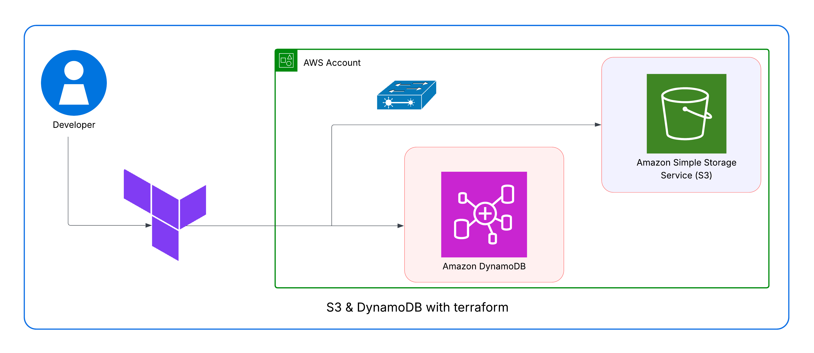

# AWS S3 and DynamoDB Terraform Infrastructure

This Terraform project automates the provisioning of AWS infrastructure components essential for managing Terraform state:

1. An S3 bucket with a unique name for storing Terraform state files
2. A DynamoDB table for state locking to prevent concurrent operations



## Infrastructure Components

### S3 Bucket
- **Unique Naming**: Uses random hexadecimal ID generation to ensure globally unique bucket names
- **Configurable Settings**: Customizable bucket name prefix and force destroy options
- **Public Access**: Configurable public access settings (default allows public access)
- **Tagging**: Automatic tagging with environment information

### DynamoDB Table
- **State Locking**: Configured specifically for Terraform state locking
- **On-demand Capacity**: Uses PAY_PER_REQUEST billing mode for cost optimization
- **Schema**: Includes LockID as the hash key for state management

## Prerequisites

- [Terraform](https://www.terraform.io/downloads.html) (v1.0.0+)
- AWS credentials configured via environment variables or AWS CLI
- Appropriate IAM permissions to create S3 buckets and DynamoDB tables

## Quick Start

1. **Clone the repository**:
   ```bash
   git clone <repository-url>
   cd aws-s3-dbtable-terraform-project
   ```

2. **Configure variables**:
   Edit `terraform.tfvars` to set your desired values:
   ```hcl
   s3_bucket_name = "your-bucket-name"
   environment = "dev"
   ```

3. **Initialize Terraform**:
   ```bash
   terraform init
   ```

4. **Review the execution plan**:
   ```bash
   terraform plan
   ```

5. **Apply the configuration**:
   ```bash
   terraform apply
   ```

6. **Use the outputs**:
   After successful application, Terraform will output:
   - S3 bucket name (with unique suffix)
   - S3 bucket region
   - DynamoDB table name

## Remote State Configuration

This project includes configuration for Terraform remote state management:

```hcl
terraform {
  backend "s3" {
    bucket         = "bucket-name"
    key            = "terraform.tfstate"
    region         = "us-east-1"
    dynamodb_table = "terraform-remote-state-lock"
    encrypt        = true
  }
}
```

Update the `bucket` and other values in `version.tf` to match your environment.

## Variables

| Name | Description | Default |
|------|-------------|---------|
| `bucket_name` | Base name of the S3 bucket | - |
| `force_destroy` | Allow force deletion of the S3 bucket | `true` |
| `aws_region` | AWS region to deploy resources | - |
| `s3_bucket_name` | Name of the S3 bucket for Terraform state | - |
| `dynamodb_table_name` | Name of the DynamoDB table for state locking | - |
| `environment` | Environment for the resources | `dev` |

## Outputs

| Name | Description |
|------|-------------|
| `bucket_name` | The full name of the created S3 bucket |
| `bucket_region` | The region where the S3 bucket is created |
| `dynamodb_table_name` | The name of the DynamoDB table |

## Security Considerations

- The default configuration allows public access to the S3 bucket
- For production use, consider modifying the public access block settings
- Ensure proper IAM permissions are in place

## Clean Up

To destroy all created resources:

```bash
terraform destroy
```

## License

This project is licensed under the MIT License - see the LICENSE file for details.